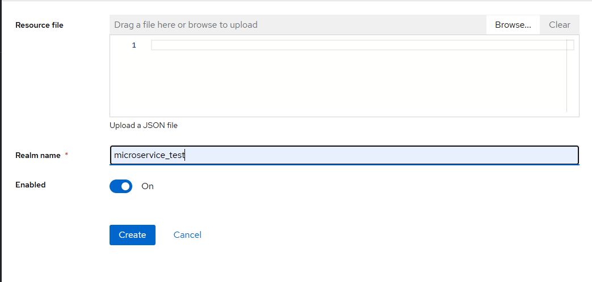
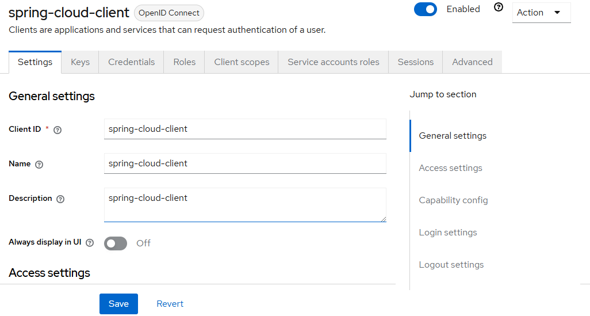

# Keycloak Setup with Docker

## Prérequis

- Docker installé sur votre machine

## Étapes de Configuration

### 1. Télécharger et Démarrer Keycloak

Exécutez la commande suivante pour démarrer Keycloak avec Docker :

```bash
docker run -p 8181:8080 \
  -e KC_BOOTSTRAP_ADMIN_USERNAME=admin \
  -e KC_BOOTSTRAP_ADMIN_PASSWORD=admin \
  quay.io/keycloak/keycloak:26.0.2 start-dev
```


### 2. Créer un Compte Admin

Accédez à l'interface d'administration via votre navigateur :
- URL : `http://localhost:8181`
- Nom d'utilisateur : `admin`
- Mot de passe : `admin`


### 3. Créer une Realm

1. Allez dans `Realms` dans le menu principal
2. Cliquez sur `Create Realm`
3. Donnez un nom à votre Realm (ex : `my-realm`)
4. Cliquez sur `Create`



### 4. Créer un Client à Sécuriser

1. Dans la page de votre Realm, allez dans `Clients`
2. Cliquez sur `Create`
3. Donnez un nom à votre client (ex : `spring-cloud-client`)
4. Choisissez le type de client (Confidential pour une application web)
5. Cliquez sur `Save`



### 5. Créer des Utilisateurs

1. Allez dans `Users`
2. Cliquez sur `Add User`
3. Remplissez les informations pour l'utilisateur
4. Cliquez sur `Save`


### 6. Créer des Rôles

1. Allez dans `Roles`
2. Cliquez sur `Add Role`
3. Définissez le rôle (ex : `admin`, `user`)
4. Cliquez sur `Save`


### 7. Affecter les Rôles aux Utilisateurs

1. Allez dans la page de votre utilisateur
2. Sélectionnez l'onglet `Role Mappings`
3. Ajoutez les rôles créés précédemment


### 8. Tester l'Authentification avec Postman

#### Authentification avec Mot de Passe

Endpoint : `http://localhost:8181/realms/my-realm/protocol/openid-connect/token`
Méthode : POST

Paramètres :
- `client_id`: my-client
- `client_secret`: <votre_client_secret>
- `username`: <nom_utilisateur>
- `password`: <mot_de_passe>


#### Authentification avec Refresh Token

Endpoint : `http://localhost:8181/realms/my-realm/protocol/openid-connect/token`
Méthode : POST

Paramètres :
- `client_id`: my-client
- `client_secret`: <votre_client_secret>
- `grant_type`: refresh_token
- `refresh_token`: <votre_refresh_token>


#### Authentification avec Client Credentials

Utilisez l'endpoint avec `grant_type=client_credentials`

### 9. Configurer les Paramètres des Tokens

1. Allez dans `Realm Settings` > `Tokens`
2. Modifiez les durées d'expiration des tokens


## Ressources Supplémentaires

- [Documentation officielle Keycloak](https://www.keycloak.org/docs/)

## Conseils de Sécurité

- Changez toujours les mots de passe par défaut en production
- Utilisez HTTPS pour toutes les communications
- Limitez l'accès à l'interface d'administration

## Dépannage

- Vérifiez que Docker est en cours d'exécution
- Assurez-vous que le port 8181 n'est pas déjà utilisé
- Consultez les logs Docker en cas de problème de démarrage

## Licence

Ce guide est distribué sous licence MIT.
